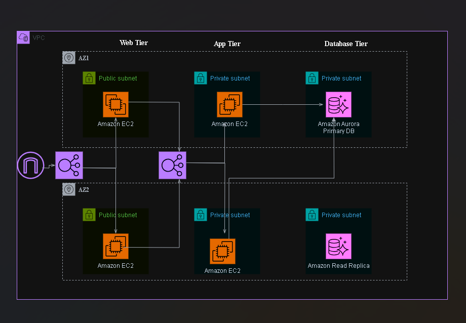
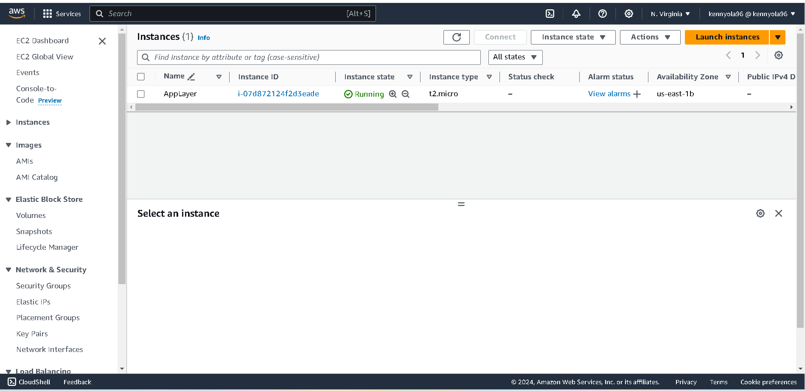

# Three Tier Web App Deployment on AWS

This repository contains the necessary resources and configuration files to deploy a three-tier web application on Amazon Web Services (AWS). The application architecture consists of the following tiers:

1. **Web Tier**: NGINX web server serving a React.js website.
2. **Application Tier**: Node.js application running on an EC2 instance.
3. **Data Tier**: Aurora database deployed on AWS RDS.

## Architecture Diagram

## Deployment Steps

### 1. Download Code from GitHub and Upload to S3
- Clone this repository to your local machine.
- Upload the application code to an S3 bucket in your AWS account. This S3 bucket will serve as the source for EC2 instances to access the application code.

### 2. IAM EC2 Role Setup
- Create an IAM EC2 role to securely connect to instances using AWS Systems Manager Session Manager. This role should have the necessary permissions to interact with EC2 instances and other AWS resources required for the application.

### 3. VPC Networking Components and Security Groups
- Set up Virtual Private Cloud (VPC) networking components including subnets, route tables, and internet gateways.
- Configure security groups to protect EC2 instances, Aurora databases, and Elastic Load Balancers (ELBs) ensuring only necessary traffic is allowed.

### 4. Deploy Database Layer
- Deploy an Aurora database instance on AWS RDS. Configure the necessary settings such as instance type, storage, and security groups.

### 5. Deploy Application Tier

- Launch an EC2 instance for the application tier. Use the previously created IAM EC2 role for secure connections.
- Install Node.js and any required dependencies on the EC2 instance.
- Retrieve the application code from the S3 bucket and deploy it on the EC2 instance.

### 6. Enable Autoscaling for Application Tier
- Create an Amazon Machine Image (AMI) of the configured EC2 instance to enable autoscaling.
- Set up autoscaling with a load balancer for the application tier to handle increased traffic efficiently.

### 7. Deploy Web Tier
- Launch another EC2 instance for the web tier. Utilize the AMI created in the previous step for consistent configuration.
- Install NGINX web server on the EC2 instance.
- Configure NGINX to serve the React.js website.

### 8. Configure External-Facing Load Balancer
- Set up an external-facing Elastic Load Balancer (ELB) to distribute incoming traffic across multiple instances in the web tier.
- Configure the ELB to perform health checks on the instances and route traffic accordingly.

### 9. Final Configuration
- Verify that the NGINX web server is correctly serving the React.js website.
- Test the application to ensure all components are functioning as expected.

## Resources
- [AWS Documentation](https://docs.aws.amazon.com/)
- [NGINX Documentation](https://nginx.org/en/docs/)
- [React Documentation](https://reactjs.org/docs/getting-started.html)

